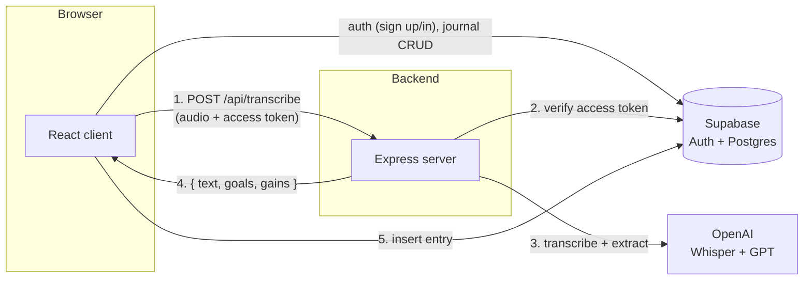

# Thinkra


[](LICENSE)

A speech-to-text daily journal. Talk out loud about your day for a few seconds and Thinkra transcribes it, uses AI to pull out the **gains** (what you accomplished) and **goals** (what you want to do next), and saves them as a structured entry you can browse by date.

You can also skip the recording and type entries directly.

## The idea behind it

The name comes from *[The Gap and The Gain](https://www.thegapandthegain.com/)* by Dan Sullivan and Dr. Benjamin Hardy. Its core idea: when you measure yourself against an ideal or a goal (the **Gap**), you always feel behind, no matter how much you've actually done. When you instead measure yourself against where you started (the **Gain**), the same day looks like progress.

Thinkra operationalizes that daily, in two parts:

- **Gains** — what you actually did today, captured while it's fresh, so it isn't lost to hindsight the next time you're being hard on yourself.
- **Goals** — the gap you're choosing to close next, framed forward instead of as a shortfall.

The app has no formal affiliation with the book or its authors — it's an independent tool built around that framing.

## Table of contents

- [The idea behind it](#the-idea-behind-it)
- [Features](#features)
- [Architecture](#architecture)
- [Tech stack](#tech-stack)
- [Project structure](#project-structure)
- [Getting started](#getting-started)
- [Environment variables](#environment-variables)
- [Available scripts](#available-scripts)
- [Deploying your own instance](#deploying-your-own-instance)
- [Security notes](#security-notes)
- [Roadmap / possible future work](#roadmap--possible-future-work)
- [Contributing](#contributing)
- [License](#license)

## Features

- **Voice journaling** — record a short clip describing your day; it's transcribed with OpenAI Whisper and automatically split into goals and gains with GPT.
- **Manual entries** — add or edit goals/gains as plain text, no microphone required.
- **Per-day cards** — one card per date, each independently editable (add/remove individual goals or gains) or deletable, with optimistic UI updates.
- **Calendar filter** — a monthly calendar highlights days that have entries and lets you filter the list down to one or more selected dates.
- **Authentication** — email/password sign-up, sign-in, and forgot/reset-password flows via Supabase Auth. (Social login buttons for Apple/Facebook/Google exist in the UI but are currently disabled — see [Roadmap](#roadmap--possible-future-work).)
- **Row-level data isolation** — every journal entry is scoped to its owner via Postgres Row-Level Security, enforced by Supabase regardless of which client hits the database.
- **Light/dark theme** — toggle in Settings, persisted across sessions.
- **Responsive UI** — usable on both desktop and mobile, including a full-screen recording overlay with a volume-reactive visualizer (stoppable by clicking or pressing spacebar).

## Architecture

The app is two pieces that talk to Supabase independently:



**The client (`client/`) owns almost everything.** It's a React SPA that talks to Supabase directly using the Supabase JS client: signing in, signing up, reading/creating/updating/deleting journal entries — all of it goes straight from the browser to Supabase, protected by Row-Level Security policies (`auth.uid() = user_id`) rather than by an API layer.

**The server (`server/`) does exactly one thing: transcription.** The only backend endpoint is `POST /api/transcribe`. The flow for a voice entry is:

1. The browser records audio (`MediaRecorder`) and sends it, along with the user's Supabase access token, to the Express server.
2. The server verifies the token against Supabase (`supabase.auth.getUser`) — it never has its own login system, it just checks tokens issued by Supabase Auth.
3. The audio is sent to OpenAI Whisper for transcription, then the transcript is sent to GPT (`gpt-4o-mini`) with a prompt that extracts goals/gains as structured JSON.
4. The server returns `{ text, result: { goals, gains } }` to the client.
5. The client then writes the resulting entry to Supabase itself (the server never touches the `daily_entries` table).

A server is required only because the `OPENAI_API_KEY` must stay off the client — everything else could in principle run as a static site talking straight to Supabase.

### Data model

A single table, `daily_entries`, holds all journal data (see [`supabase/migrations/0001_init.sql`](supabase/migrations/0001_init.sql)):

| Column | Type | Notes |
|--------|------|-------|
| `id` | `uuid` | primary key, default `gen_random_uuid()` |
| `user_id` | `uuid` | foreign key → `auth.users.id`, `on delete cascade` |
| `date` | `date` | the journal date this entry belongs to |
| `goals` | `text[]` | default `'{}'` |
| `gains` | `text[]` | default `'{}'` |
| `created_at` | `timestamptz` | default `now()` |
| `updated_at` | `timestamptz` | nullable, set on edit |

Row-Level Security is enabled with one policy per operation (select/insert/update/delete), each requiring `auth.uid() = user_id`.

## Tech stack

- **Frontend:** React 19, Vite (rolldown-vite), TypeScript, Tailwind CSS, shadcn/ui (Radix primitives), TanStack Query, React Router, `motion` for animation
- **Backend:** Node.js, Express 5, TypeScript (run via `tsx`, no build step needed in dev)
- **Auth & Database:** Supabase (Postgres + Auth + Row-Level Security)
- **AI:** OpenAI Whisper (`whisper-1`) for transcription, GPT (`gpt-4o-mini`) for goal/gain extraction

## Project structure

```
gap-and-gain/
├── client/                  # React + Vite frontend
│   └── src/
│       ├── components/      # UI components, modals, shadcn/ui primitives
│       ├── context/         # AuthContext (Supabase session state)
│       ├── hooks/           # useEntries (TanStack Query CRUD hooks)
│       ├── interfaces/      # Shared TS types
│       └── utils/           # Supabase client, misc helpers
├── server/                  # Express backend (transcription only)
│   ├── routes/               # /api/transcribe
│   ├── middleware/           # Supabase token auth middleware
│   ├── services/             # OpenAI calls (transcription + extraction)
│   └── utils/                 # Supabase (service role) + OpenAI clients
├── supabase/
│   └── migrations/           # SQL schema + RLS policies
└── .github/workflows/        # CI (lint, build, typecheck)
```

## Getting started

### Prerequisites

- Node.js v20 or higher
- An [OpenAI API key](https://platform.openai.com/api-keys)
- A [Supabase](https://supabase.com) project (free tier is enough)

### 1. Clone the repository

```bash
git clone https://github.com/joaoncfsantos/gap-and-gain.git
cd gap-and-gain
```

### 2. Install dependencies

From the repo root, this installs both `client/` and `server/` dependencies:

```bash
npm run install:all
```

(Or install each separately with `npm install --prefix client` / `npm install --prefix server`.)

### 3. Set up the database

In your Supabase project, run the migration in [`supabase/migrations/0001_init.sql`](supabase/migrations/0001_init.sql). Either:

- Paste its contents into the Supabase Dashboard's SQL Editor and run it, or
- Use the [Supabase CLI](https://supabase.com/docs/guides/local-development/cli/getting-started): `supabase link --project-ref <your-project-ref>` then `supabase db push`.

This creates the `daily_entries` table with Row-Level Security policies already configured.

### 4. Configure environment variables

**Server** — `server/.env` (copy from `server/.env.example`):

```bash
cp server/.env.example server/.env
```

```env
OPENAI_API_KEY=your_openai_api_key
PORT=3000
VITE_SUPABASE_URL=https://your-project-ref.supabase.co
SUPABASE_SERVICE_ROLE_KEY=your_service_role_key
CORS_ORIGIN=http://localhost:5173
```

**Client** — `client/.env.local` (copy from `client/.env.example`):

```bash
cp client/.env.example client/.env.local
```

```env
VITE_SUPABASE_URL=https://your-project-ref.supabase.co
VITE_SUPABASE_ANON_KEY=your_anon_or_publishable_key
VITE_API_URL=http://localhost:3000
```

### 5. Run it

From the repo root, this starts both the server and the client together:

```bash
npm run dev
```

(Or in two terminals: `npm run dev:server` and `npm run dev:client`.)

### 6. Open the app

Visit `http://localhost:5173`, sign up for an account, and start recording.

## Environment variables

### Server (`server/.env`)

| Variable | Required | Description |
|---|---|---|
| `OPENAI_API_KEY` | Yes | Used for both Whisper transcription and GPT extraction. |
| `PORT` | No | Server port. Defaults to `3000`. |
| `VITE_SUPABASE_URL` | Yes | Your Supabase project URL. |
| `SUPABASE_SERVICE_ROLE_KEY` | Yes | Used only to verify user access tokens server-side. **Never expose this to the client** — it bypasses Row-Level Security. |
| `CORS_ORIGIN` | No | Origin allowed to call the API. Defaults to `http://localhost:5173`. Set this to your deployed client's URL in production. |

### Client (`client/.env.local`)

| Variable | Required | Description |
|---|---|---|
| `VITE_SUPABASE_URL` | Yes | Your Supabase project URL. |
| `VITE_SUPABASE_ANON_KEY` | Yes | Supabase anon/publishable key — safe to expose, access is enforced by Row-Level Security. |
| `VITE_API_URL` | Yes | Base URL of the backend server (e.g. `http://localhost:3000` locally, or your deployed server's URL). |

## Available scripts

### Root (`/`)

| Script | Description |
|---|---|
| `npm run install:all` | Installs dependencies for both `client/` and `server/`. |
| `npm run dev` | Runs the client and server dev servers together. |
| `npm run dev:client` / `npm run dev:server` | Runs just one of them. |
| `npm run build` | Builds the client for production. |
| `npm run lint` | Lints the client. |
| `npm run typecheck` | Type-checks the server. |

### Client (`client/`)

| Script | Description |
|---|---|
| `npm run dev` | Start the Vite dev server. |
| `npm run build` | Type-check and build for production. |
| `npm run preview` | Preview the production build locally. |
| `npm run lint` | Run ESLint. |

### Server (`server/`)

| Script | Description |
|---|---|
| `npm run dev` | Start the server with auto-reload (`tsx watch`). |
| `npm start` | Start the server without watching. |
| `npm run typecheck` | Type-check without emitting (`tsc --noEmit`). |

## Deploying your own instance

There's no deployment automation in this repo — it's meant to be cloned and deployed with whatever platform you prefer. A couple of pointers:

- **Client** (`client/`) builds to static files (`npm run build` → `client/dist/`), so it can be hosted anywhere that serves static sites: Vercel, Netlify, Cloudflare Pages, GitHub Pages, etc. Set the client's environment variables (see above) in that platform's dashboard.
- **Server** (`server/`) is a plain Node/Express process (`npm start`, or `tsx server.ts`), so it needs a platform that runs long-lived Node processes: Railway, Render, Fly.io, a VPS, etc. Set the server's environment variables there, and set `CORS_ORIGIN` to your deployed client's URL.
- **Database** is Supabase itself — no separate database deployment needed.

Whichever platforms you pick, deploy the server first so you have its URL for `VITE_API_URL` on the client.

## Security notes

⚠️ **Never commit your `.env` / `.env.local` files** — they contain live API keys and are already covered by `.gitignore`.

- `SUPABASE_SERVICE_ROLE_KEY` bypasses Row-Level Security and must stay server-side only. It's used exclusively to validate user tokens (`supabase.auth.getUser`) — the server never uses it to read or write journal data directly.
- `OPENAI_API_KEY` is billed per use; the `/api/transcribe` endpoint requires a valid Supabase session, and uploads are capped at 24MB, but there's no additional rate limiting — see [Roadmap](#roadmap--possible-future-work).
- All journal data access is enforced at the database level via Row-Level Security, so even a bug in client code can't leak one user's entries to another.
- Found a vulnerability? Please see [SECURITY.md](SECURITY.md) rather than opening a public issue.

## Roadmap / possible future work

Ideas for anyone looking to extend this project, roughly in order of how much value they'd add:

- **Automated tests** — there's currently no test suite. `vitest` (client) and `vitest`/`node --test` (server) would fit the existing tooling; a good starting point is auth-guard behavior on `/api/transcribe` and the goal/gain extraction prompt.
- **Rate limiting** on `/api/transcribe` — currently anyone with a valid session can call it as often as they like, which is a real cost risk given it calls paid OpenAI endpoints.
- **Enable social login** — the Apple/Facebook/Google buttons already exist in the UI (`SocialMediaAuth.tsx`) but are disabled; wiring them up just needs OAuth provider configuration in the Supabase dashboard.
- **Account deletion / data export** — no self-service way to delete an account or export your entries yet.
- **Streaks & stats** — a habit-tracking app like this is a natural fit for a "current streak" or "entries this month" view.
- **CSV/PDF export** of journal history.
- **Offline support / PWA** — useful for a voice-journaling app people reach for on the go.
- **Editable extraction** — the AI-extracted goals/gains land straight in the entry; a quick review/edit step before saving (instead of only after) could catch bad transcriptions sooner.
- **Multi-language transcription** — Whisper supports many languages already; the GPT extraction prompt and UI copy are currently English-only.
- **CI test coverage** — once tests exist, wire them into `.github/workflows/ci.yml` alongside the existing lint/build/typecheck jobs.

## Contributing

Contributions are welcome — see [CONTRIBUTING.md](CONTRIBUTING.md) for how to get set up and the expected workflow.

## License

[MIT](LICENSE)
